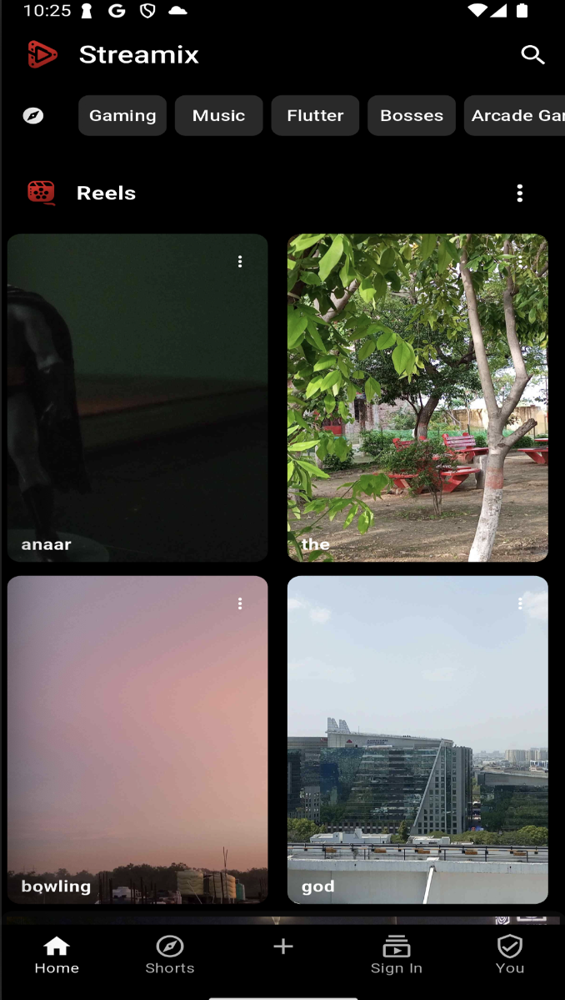
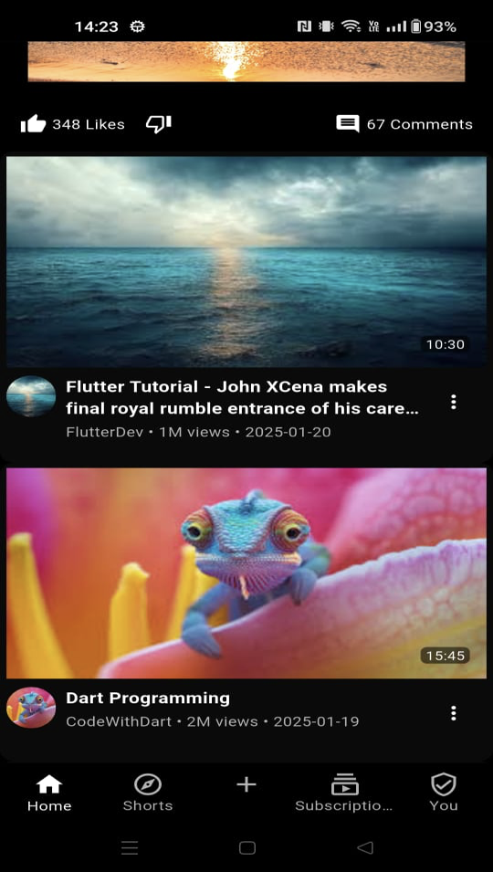
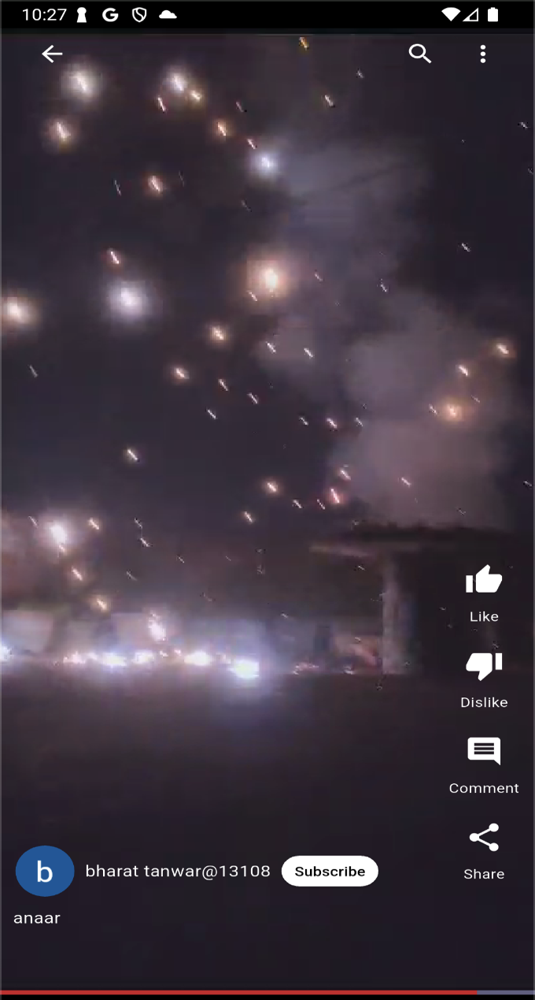
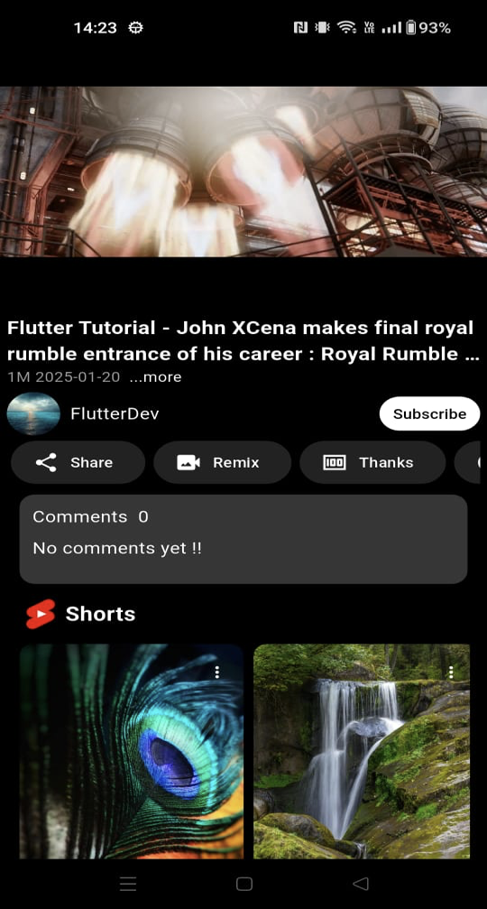
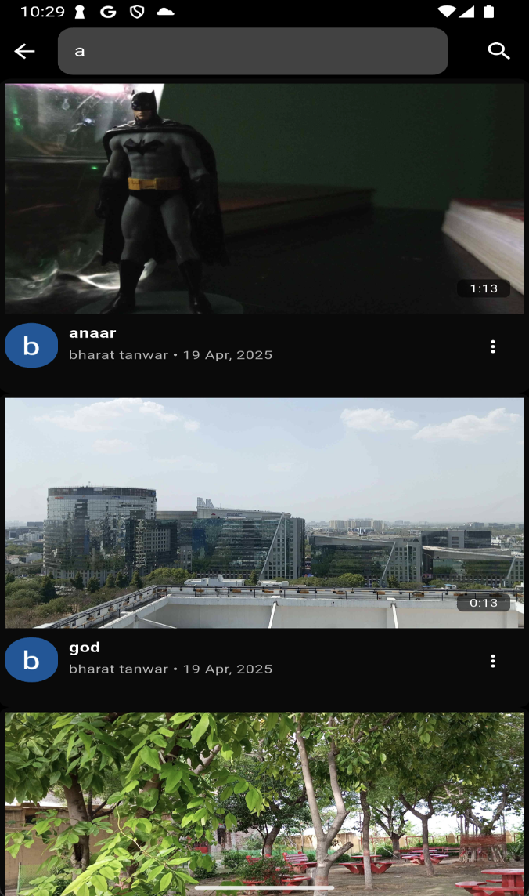
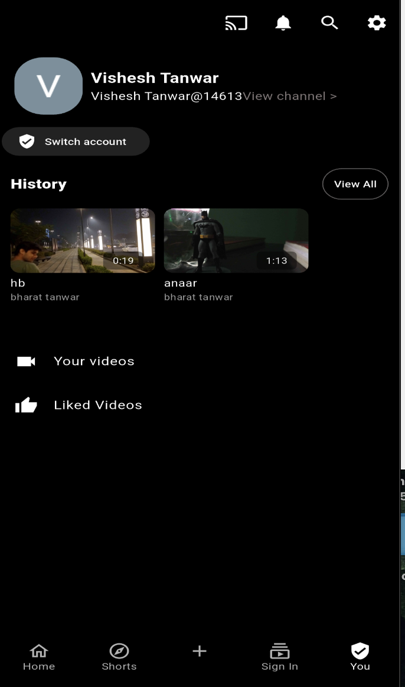
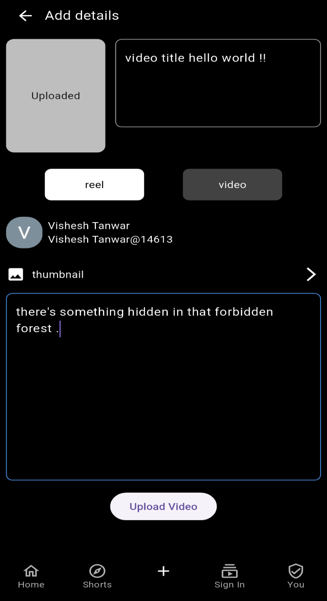
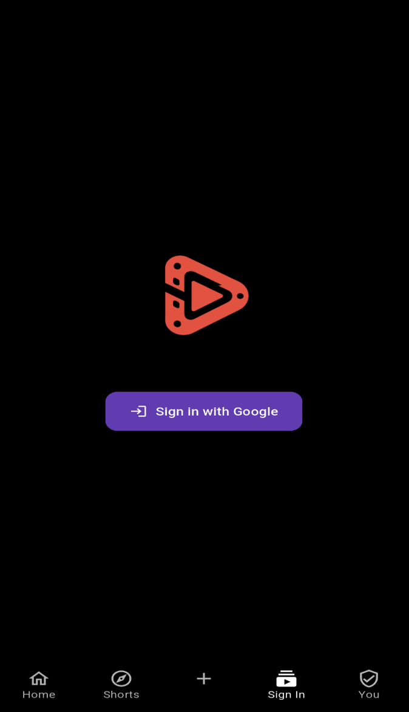
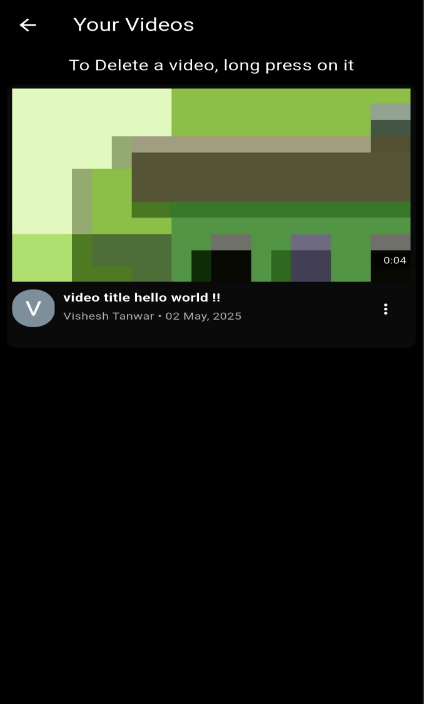

🎥 Streamix
Streamix is a video surfing app inspired by YouTube where users can explore, upload, and watch videos or short reels.
The app is built with Flutter for mobile development and Next.js for the backend. Authentication is handled via Firebase Google Auth.

🚀 Features
📺 Watch Videos & Reels – Seamless video streaming experience.

🔐 Google Authentication – Secure login & signup with Firebase.

⬆️ Upload Videos/Reels – Users can upload their own content.

🎨 Modern UI – Built using Flutter for smooth mobile experience.

⚡ Next.js Backend – Handles API, video management, and database logic.

🛠️ Tech Stack
Frontend (Mobile): Flutter
Backend: Next.js
Authentication: Firebase (Google Auth)
Database/Storage: PostgreSQL (or whichever you used) + Firebase Storage (if used for videos)

📸 Screenshots

backend - the backend code is in the repo steamix-backend
